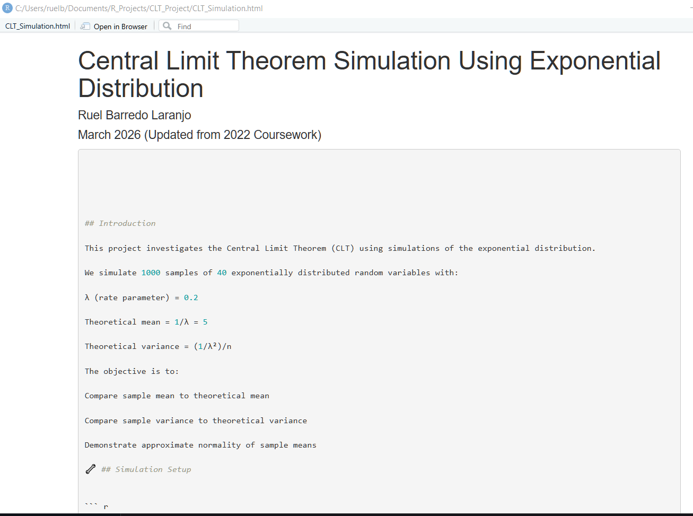
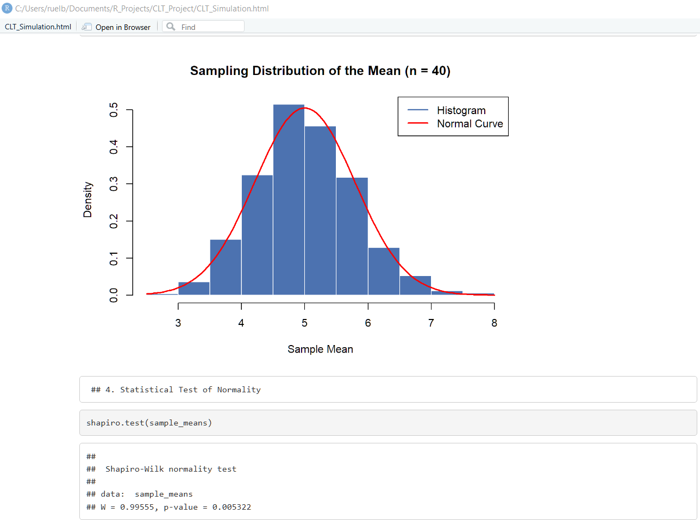
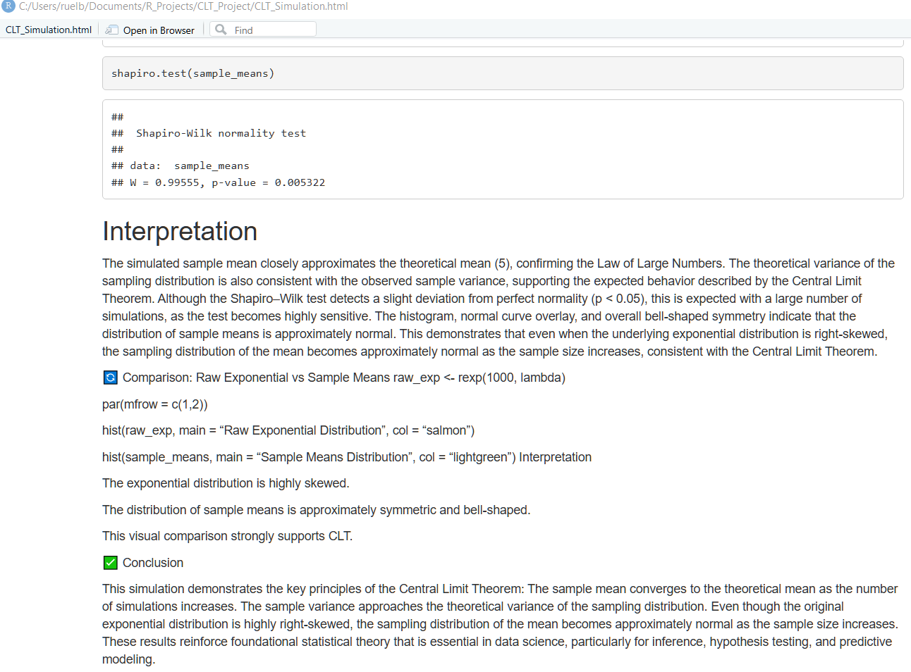

# Central Limit Theorem Simulation in R

## Overview
This project demonstrates the Central Limit Theorem (CLT) using simulations from an exponential distribution.

## Simulation Setup
- λ (rate parameter) = 0.2  
- Sample size (n) = 40  
- Number of simulations = 1000  

Theoretical mean = 1/λ = 5  
Theoretical variance = (1/λ²)/n  

## Visualization 

## Visualization 2

## Visualization 3

## Interpretation
The histogram of sample means approximates a normal distribution, confirming the Central Limit Theorem.

## Skills Demonstrated
- Statistical Simulation
- Sampling Distributions
- Data Visualization
- R Programming
- Statistical Inference

## Tools Used
- R
- RStudio
- Base R Functions
- Git & GitHub

## Author
Ruel Laranjo  
Junior Data Scientist
